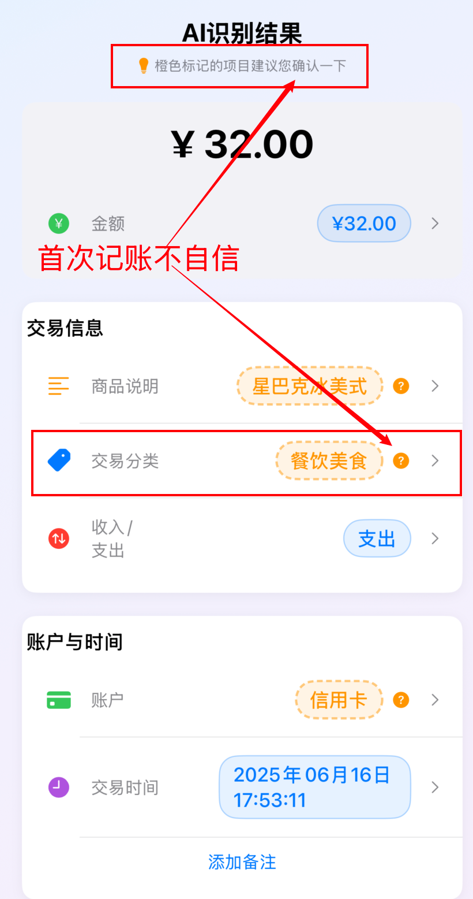

# 我坚持记账5年，攒下第一桶金后，终于写出了梦想中的AI记账App

### 导语

我坚持记账5年，攒下第一桶金后，决定把所有心得，都做进了这个AI记账助手！它不再是一个冰冷的工具，更是一个越用越懂你、与你共同成长的伙伴。

**我的故事，和给你的专属福利，都在这里👇**

---

大家好，我是Jason。六年前，刚毕业的我对未来迷茫，对钱包里的钱更是毫无概念。那时我做了一个最朴素的决定 - 开始记账 。

现在回想起来，真的要感谢当时的自己。因为对普通人来说，攒钱和投资自己，无疑是最正确的选择。当我攒下第一笔可观的积蓄时，对人生的掌控感也变强了，那种感觉，真的会上瘾。

但是，这个"好习惯"的背后，却是我长达数年、一把辛酸一把泪的记账血leì史...

## 开篇 我的 5 年记账血泪史

不知道你们有没有过这样的经历：

- **每日考古**：晚上躺在床上，翻了半小时支付宝账单，就为了回忆今天那笔15.9元到底买了什么。只因当时偷懒没有记付款的商品详情。

- 打开App想记账，却先弹出一个**自动跳转的购物广告**，等关掉广告，已经忘了要记什么，（别问我是怎么知道的），更是有一次推荐算法真实地让我在京东下单了一个充电器...

21年刚开始记账的时候，我也在“记了忘，忘了记”的循环里挣扎。用了市面上以随手记（那会还没有那么多的广告 doge）为代表的几乎所有的传统记账App后，我发现它们都逃不过一个宿命：**用的人越多，就越“反人性”**。

- 操作繁琐 ：手动输入、选分类、选账户，一套下来，新手记账耐心告罄。
- 配置复杂 ：记账模板是个好东西，但复杂的配置流程，直接劝退。
- 广告泛滥 ：想记账，结果在京东下单了个充电器。

对于记账这件事情，我的需求不高，真的。**就想要一个，安安静静、只负责记账的App。**

于是，我开始了自救之路...

## 破局 · 为什么我要亲手打造一款AI记账App？

### 第一步：快捷指令，实现半自动化

一开始，我利用苹果自带的OCR，做了个快捷指令，识别截图金额，再通过几次交互来实现账单字段的记录，包括“金额，收支类别，交易分类，交易日期，商品说明，账户，备注”七个字段。

成功解决了传统记账 app 的痛点，记账流程也从几十秒乃至几分钟缩短到了 30 秒以内。

但技术人的折腾，是永无止境的。

### 第二步：AI 加持，效率狂飙

2022年底ChatGPT爆火后，我将快捷指令做了一个升级迭代。不再只识别金额，而是将截图中所有文字打包扔给大模型，通过一个合理的 Prompt 让它返回结构化的账单信息，并存放到 number 中。

记账时间进一步缩短到十几秒！大大加速了我的记账流程。 那种快感，无与伦比。

> 当时的痛点是 ChatGPT 等一系列好用的模型虽然开放了 API，但是一方面是贵，另一方面是网络因素。不过随着模型能力的增强，现在已经不是问题了,当前主流的国产大模型就可以实现 80% 左右的识别准确率。

但我发现，这还不够...

### 第三步：从0到1，打造我的专属App

随着去年AI应用的爆发，越来越多的独立开发开始分享使用 Agent 来辅助开发的优势。我意识到一个机会：**为什么不用AI彻底解决记账这个老大难问题？**

作为一个准备入局AI应用开发的程序员，我自己的学习习惯是“干中学”，以实践为始。我需要一个能落地、能解决真实问题的项目来“练手”。

说干就干！我从一开始使用 VScode 上的 copilot 插件，转到 Cursor 和 Trae AI 进行开发，发现"vibe coding"的时代似乎真的来了。

于是我找 Gemini 进行头脑风暴，总结了我自己的记账经历，又使用了 Gemini Deep Research 调研目前市面上的记账 app 的通病以及记账用户的痛点，总结如下：

- 传统记账app ：老生常谈的一些毛病依旧存在，广告问题严重，用户体验差。
- AI记账app ：功能花哨不纯粹，缺乏真正的智能。

  - 提供语音，照相，截图识别账单功能。
  - 将每次记账的形式转成一个 chatbot 聊天框，或是融入游戏。
  - 亦或集成快捷指令来加速记账流程，这个点很不错，但是要开会员呀，我花钱记账来省钱。
  - 另外还有的可以通过和 AI 大模型对话来分析你的历史账单。
- 快捷指令派系 ：和我之前做的一样，还要收费！

在和 Gemini 多轮头脑风暴结束后，已是深夜[1]。

于是乎，Jason的AI工坊的第一个项目，就这么诞生了。

## 入迷 · 当一个项目开始“自我进化” - AI置信度系统的构想

经过了断断续续两周的 "Vibe coding" 之后，我实现了一个MVP，包含语音、拍照、截图识别记账，集成快捷指令加速记账流程，我感觉基本实现了AI记账App的所有主流功能。

> TODO 由于这一块偏技术，可以前往实现篇查阅，虽然我还没写🐶。不过可以关注我的 [GitHub repo](https://github.com/MisterWJC/SmartBookkeeping)

但真正让我兴奋的是，但真正的惊喜，来自一次和AI的“闲聊”。

有一天，我正在调试用户体验的某个页面 bug 的时候， Claude4-Sonnet 提到了一个概念：**AI置信度系统** 。这个点是我没有想到的，于是我顺着这个思路去做了一些research，发现了一扇新世界的大门，**可以让这款记账 app 的拥有“自我进化”的能力。**

简单聊一下什么是 AI 置信度系统把：

- 系统会给 AI 的每个答案打分（0-1），分数高低代表 AI 对某个结果的“确信程度”或“可信度”
- AI 不确定的，会主动告诉你(一般分数低于 0.5)
- 用户每次纠正它，它都会记住
- 下次绝不再犯同样的错误

**因此它不再是一个冰冷的工具，而是一个越用越懂你、与你共同成长的伙伴。**

想象一下：

周一早晨，通勤路上，你冲进星巴克，用公司发的福利卡买了一杯超大杯冰美式，价格 ¥32。 你习惯性地打开记账APP，对着手机说：**“早上用公司卡买了杯星巴克冰美式，32块。”**

正常 AI 可能会武断地将其归为“餐饮美食”。

但搭载置信度系统的记账助手会“聪明地犯难”，它捕捉到“公司卡”这个关键信息，意识到这笔开销有工作属性（可能属于“工作开销”），于是**主动亮起“黄灯”**，在分类旁提示：“我有 60%把握分到‘餐饮美食’，您看对吗？” 

​										(App AI 识别结果页面)

你只需轻点修正为“工作开销”。神奇的是，**下次再用公司卡买咖啡时，它已自信地预填好正确分类（绿灯80%把握），并贴心备注：“按您上次的指导！”** 

一个**懂得“提问”、善于“学习”、越用越懂你的智能伙伴**。它对自己不那么自信的猜测，还会用**提示黄灯**主动提醒我。这才叫智能记账，不是吗？

未来的它应该记住我每一次的消费习惯，主动为我预填信息。这，才是我心中记账App的最终形态。

> **AI as not only Crutch but also Coach**
>
> 其实当时的我是震惊的，因为已经不止一次在和 AI 讨论的过程中迸发出意想不到的灵感。这个观点我非常支持，如今 AI 不仅仅是一个辅助手段了，对于这一观点你怎么看，欢迎在评论区讨论。

## 未来与邀请 · 这只是一个开始

我的目标，是让记账从主动的“**记录**”，变成被动的“**确认**”，彻底解放你的时间和精力，将记账的效率极致化。既然目前市面上没有我想要的产品，那我就自己做一个。

我相信技术应该让生活更简单。因此我决定用AI的力量，重新定义记账这件事。

**这也是我创办AI工坊的原因， 在这里，邀请你们见证一些有趣的想法变为现实。**

如果你也对AI感兴趣，或者也被记账问题困扰过，欢迎关注我，可以在评论区告诉我，你最希望记账app解决什么问题？

完整的App还在开发中，但我已经迫不及待地想与你分享这种‘AI赋能’的记账快感。接下来，我会在这里记录整个开发过程。从需求分析到技术选型，从UI设计到AI训练，我会毫无保留地分享。这款App的成长，离不开每一个真实用户的声音。如果你也对这个项目感兴趣，欢迎关注我，成为它的第一批见证者和共创者。

**看到这里不容易，感谢你看完我的记账流水账！** 

因此作为回馈，我要发福利了。

我把最近使用的记账三年的快捷指令分享出来，你只需要点击快捷键就可以快速记账到本地 numbers，不用担心数据隐私问题，当然你也可以将 numbers 账本备份到 iCloud。

---

🎉 IOS用户专属福利 ：我用了3年的AI记账快捷指令

- 一键快速记账到本地Numbers
- 无需担心数据隐私问题
- 支持iCloud备份

----

🎁 如何免费领取？

1️⃣ 关注公众号【Jason的AI工坊】

2️⃣ 后台回复： AI记账 

3️⃣ 获取详细配置教程和指令链接

[1.头脑风暴记录，这里的思路借鉴了hands-on guide，感谢 datawhale YYDS](https://github.com/MisterWJC/SmartBookkeeping/blob/main/SmartBookkeeping-PRD/Requirement_Docs/0_HandsOn_Guide.md)